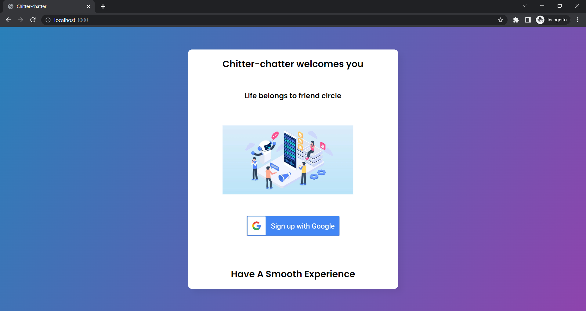
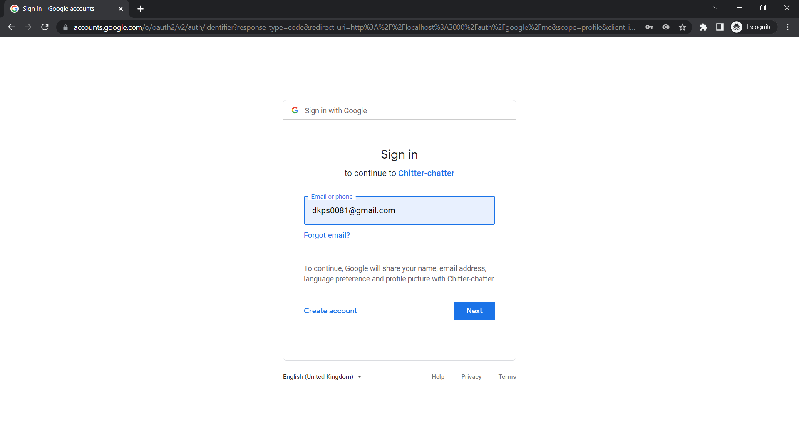
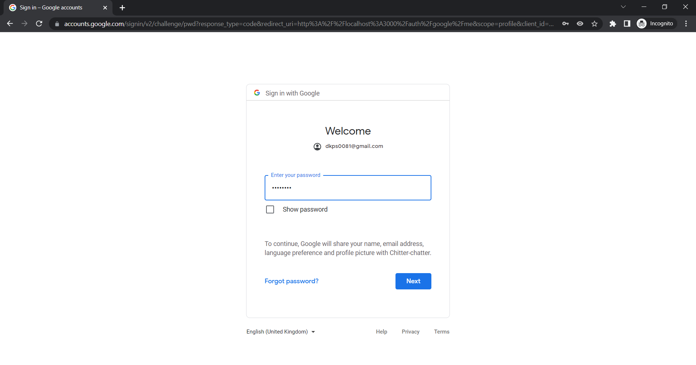
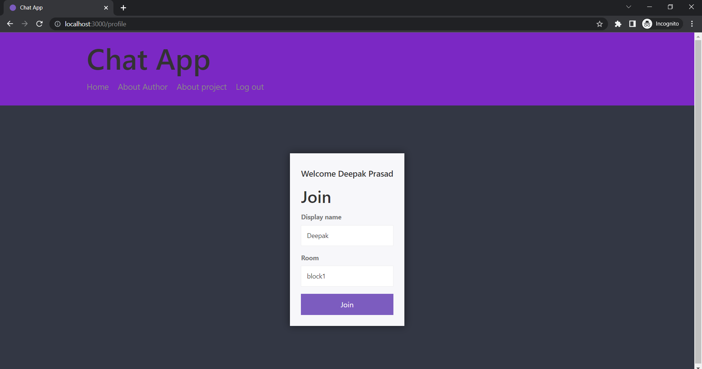
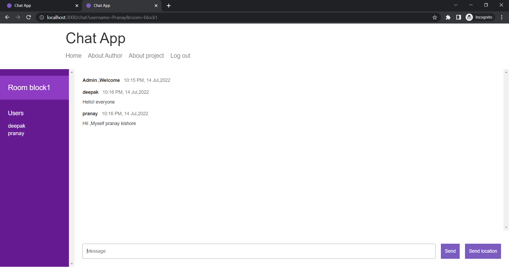
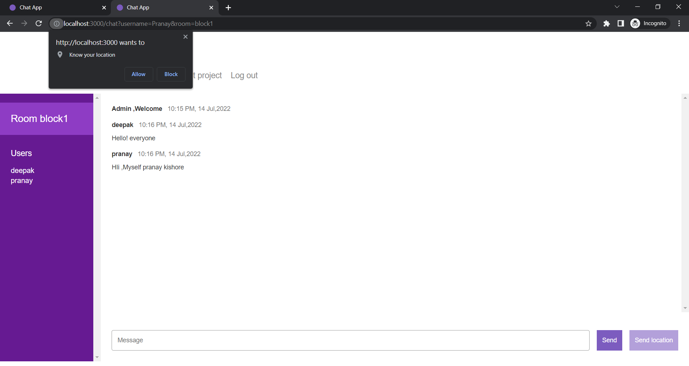
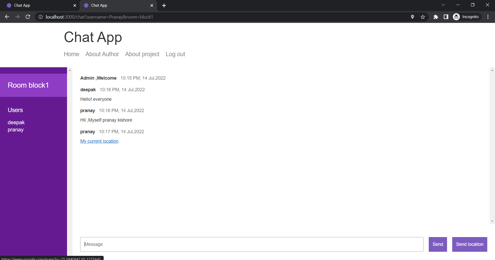
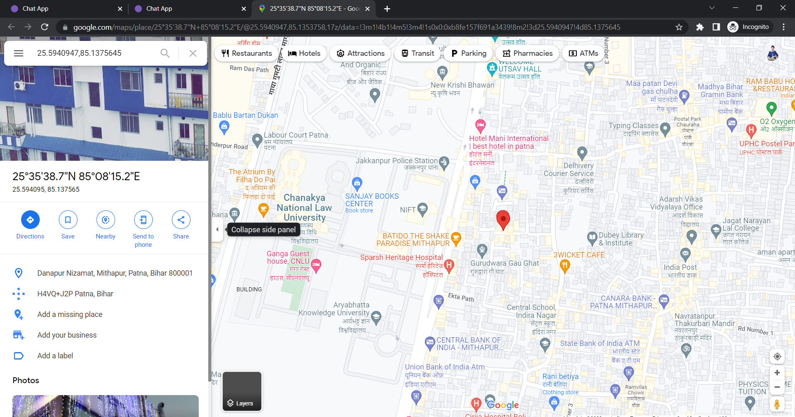

# Realtime Chat-app
**This is a Real time chat web application which connects friends family and colleagues and allows them to chat and also allow them to share their live location**
## Dependencies used
   * [Mongoose](https://mongoosejs.com/docs/)
   * [EJS](https://ejs.co/)
   * [Express](http://expressjs.com/)
   * [Passport](http://www.passportjs.org/docs/)
   * [Socket.IO](https://socket.io/docs/v4/)
## Installation
### Cloning the repository:
- Clone the repository using `git clone https://github.com/Dkps0081/Realtime-chat-engine.git` .
### Installing dependencies:
- Run `npm install`.

## Starting the server 
- Open terminal and Run `npm start` to start the server.
- Open http://localhost:3000 to view it in the browser.

## Welcome Page
  
## Sign in Page
  
  
## Join chat room
  
## Chat Section
     
## Collaborative White Board
  
## Meeting End
  
